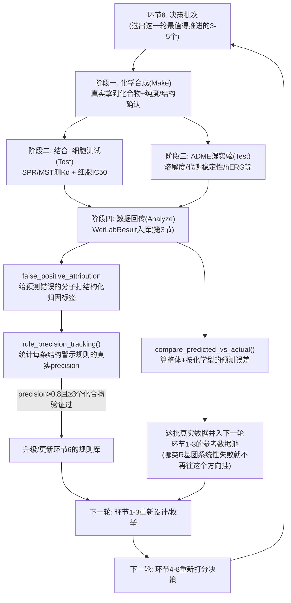

# 环节9：湿实验怎么做、数据怎么回传、DMTA闭环具体怎么转起来

代码：[`core/feedback.py`](../core/feedback.py) · **状态：回传schema和分析函数真实可跑；
湿实验本身本仓库没有实验伙伴，没有真实数据，下面讲的是"如果有，具体怎么做"**

## 目录

1. [为什么这一环节存在](#1-为什么这一环节存在)
2. [你说的"第6步：湿实验验证"，拆成四个真实阶段](#2-你说的第6步湿实验验证拆成四个真实阶段)
3. [湿实验回传Schema（环节9.1）](#3-湿实验回传schema环节91)
4. [预测vs实测复盘（环节9.2第1条）](#4-预测vs实测复盘环节92第1条)
5. [假阳性归因（环节9.2第2条）](#5-假阳性归因环节92第2条)
6. [规则治理（环节9.3）：precision追踪决定规则能不能升级成硬拒绝](#6-规则治理环节93precision追踪决定规则能不能升级成硬拒绝)
7. [前瞻验证（环节9.2第4条）](#7-前瞻验证环节92第4条)
8. [完整闭环：干实验和湿实验具体怎么接起来转成一个圈](#8-完整闭环干实验和湿实验具体怎么接起来转成一个圈)

---

## 1. 为什么这一环节存在

前面所有环节（0-8）产出的都是**预测**。环节9是整条管线唯一能验证这些
预测对不对的地方——没有这一环，管线只是一套自洽但可能系统性跑偏的假设。
原设计文档"环节9.2"规定了每轮DMTA(Design-Make-Test-Analyze)循环必做的
四件事，本模块实现了其中可以用纯代码表达的部分（第4-7节）；真正的
"Make"和"Test"发生在真实实验室里，不是代码，第2节讲清楚那部分具体
怎么做。

**先把你说的6个步骤和本仓库的"环节0-9"对上号**，免得两套编号来回切换
时搞混：

| 你说的步骤 | 对应本仓库的"环节" | 本仓库真实状态 |
|---|---|---|
| 步骤1 获取数据 | 环节1(标准化)+环节2(结构准备) | ✅ 真实可跑，见[10](10-pipeline-walkthrough.md#2-走一遍纯计算链路run_discovery_roundpy) |
| 步骤2 设计骨架 | 环节2(部分)+骨架设计 | ✅ illustrative_only，见[16第3节](16-visual-dashboard.md)/[17](17-designer-thought-process.md) |
| 步骤3 枚举 | 环节3 | ✅ 真实可跑，见[10第2.1节](10-pipeline-walkthrough.md) |
| 步骤4 打分筛选 | 环节4 L1-L2(对接) | ✅ 真实可跑，见[04](04-funnel-docking.md) |
| 步骤5 GPU精确物理模拟 | 环节4 L3(MD，demo级真实跑过)/L4(FEP，未跑) | 🟡/🔴，见[10第6节](10-pipeline-walkthrough.md) |
| 步骤6 湿实验验证 | 环节9（本文档） | 🔴 没有实验伙伴，没有真实数据——本文档讲清楚"真实该怎么做"+"数据回来之后代码里怎么接" |

## 2. 你说的"第6步：湿实验验证"，拆成四个真实阶段

打分漏斗最后筛出的3-5个候选分子，要走完下面四个真实阶段才能拿到
能验证预测的数据。每个阶段都对应`WetLabResult`（第3节）里的一组字段——
这不是巧合，是因为这个schema就是逐字照抄这四个阶段真实产出什么数据
设计出来的。

### 2.1 阶段一：化学合成(Make)——从"纸面结构"到真实拿到化合物

**怎么做**：把漏斗筛出的候选结构（SMILES）连同本仓库`core/synthesis.py`
给出的参考合成路线，交给CRO（合同研究组织，比如药明康德、康龙化成这类
真实存在、全球制药行业普遍使用的化学合成外包公司）或内部化学家。
真人化学家拿到AI/软件给出的路线建议后，会重新评估试剂真实的可获得性、
每一步反应条件是否互相兼容、成本——不会直接照搬。确定路线后按步骤
合成：每步反应后用TLC(薄层色谱，快速判断反应有没有走完)或LC-MS监测，
粗产物用柱层析或重结晶等方法纯化分离出目标产物，最后用**NMR**(核磁
共振，测分子里不同化学环境的氢/碳原子核在磁场中的共振频率，反推出
原子连接方式对不对)和**LC-MS**(先液相色谱按极性/大小分离，再质谱测
分子离子的质荷比确认分子量对不对)做结构确认，HPLC测纯度(制药行业
通常要求>95%才算合格批次)。

**为什么这么做**：计算机设计出来的结构只是"纸面结构"，真实合成常常因为
某步反应条件不兼容、某个中间体不稳定而失败或产率极低——这一步真实
产出的不只是"化合物"本身，还有"这条路线到底好不好走"这个工程信息。
如果同一个骨架的多个候选反复在同一步卡住，这本身就是一个该反馈回
"骨架设计"阶段的信号：这个骨架打分再高，如果系统性难合成，性价比可能
不如打分略低但好合成的备选——这正是第8节"闭环"里要讲的，合成阶段本身
也会产生反馈信号，不只是最终测试结果才算反馈。

**涉及知识点**：有机合成反应（呼应[10第10节](10-pipeline-walkthrough.md#10-深入aizynthfinder的神经网络在想什么)
提到的USPTO模板类反应）、分离纯化原理（柱层析/重结晶利用的是不同
分子在固定相-流动相或溶剂间分配系数的差异）、分析化学结构确证
（NMR测的是原子核磁共振频率，LC-MS测的是质荷比）。

**对应代码字段**：`WetLabResult`的`compound_id`/`batch_id`/
`smiles_as_made`/`purity_pct`/`chirality_confirmed`——第3节细讲这些
字段为什么是现在这个样子。

### 2.2 阶段二：结合与功能测试(Test——活性这一半)

这里分两层，测的是完全不同的两件事。

**第一层，生化层面——分子和纯化靶点蛋白结合得牢不牢**：

- **SPR(表面等离子共振)**：把靶点蛋白固定在一块传感芯片表面，含候选
  化合物的溶液连续流过芯片，结合事件会改变芯片表面局部的光学折射率，
  仪器实时记录这个信号随时间变化的曲线。
- **MST(微量热泳动)**：测的是化合物结合到靶点蛋白前后，复合物在一个
  微小温度梯度场里扩散速率的变化（分子变大、表面电荷/水化层变化都会
  影响这个扩散速率）。

两种方法原理完全不同，但都能拟合出同一组结合动力学常数：**ka**(结合
速率常数)、**kd**(解离速率常数)，以及**Kd=kd/ka**(平衡解离常数，数值
越小结合越牢，这是最终报告里最常引用的单一数字)。真实项目常常两种
方法都测（正交验证），因为每种方法各自有自己的假阳性模式（比如SPR
对分子固定在芯片表面的朝向敏感，MST对化合物本身的荧光/吸收性质敏感）。

**第二层，细胞层面——药物在活细胞里能不能真的起效**：把候选化合物加到
真实携带目标基因型(比如del19+C797S)的培养细胞里，测细胞增殖/存活的
抑制曲线，拟合出**细胞IC50**。

**为什么要分两层**：生化Kd测的是"分子和纯化蛋白在试管里结合得牢不牢"，
这是最直接的靶点结合证据；但药物要在真实细胞里起效，还要先穿过细胞膜、
躲开外排泵（比如MDR1这类药物外排转运蛋白会把进入细胞的药物重新泵
出去）、避开细胞内代谢降解。细胞IC50经常比生化Kd差好几个数量级——
这个差距本身是诊断信息：如果生化Kd很好但细胞IC50很差，说明问题不在
"结合"，在"进不去细胞"或"进去了又被泵出来"，这直接决定了下一轮该优化
哪个性质（比如亲脂性、是不是MDR1底物），不是盲目改骨架。

**涉及知识点**：结合动力学(Kd=kd/ka的推导)、光学/热力学检测原理、
细胞膜转运与外排泵机制。

**真实项目里常见的其他正交方法，这里一并点名，原理不展开**：**ITC**
(等温滴定微量热法，直接测结合时放出/吸收的热量，不需要任何标记，
缺点是需要的蛋白量比SPR/MST大得多)、**TR-FRET**(时间分辨荧光共振能量
转移，靠两个标记好的分子靠近时产生的荧光信号变化判断结合，常用于
高通量初筛，比SPR/MST更快但需要给蛋白/化合物加荧光标记，标记本身
可能干扰真实结合)、**MTT/CCK-8**(两种基于细胞代谢活性显色反应的
细胞增殖/毒性检测试剂，是"细胞IC50"最常用的两种具体读出方法，前面
说的"细胞增殖/存活抑制曲线"实操上通常就是用其中一种试剂显色后测
吸光度拟合出来的)。

**对应代码字段**：`WetLabResult`活性组的`genotype`/`assay_format`/
`atp_conc_um`/`readout`/`value`/`unit`/`censoring`/`n_replicates`，
选择性组的`wt_value`/`fold_selectivity`（交叉测野生型EGFR，确认这个
分子对突变体是不是真的有选择性，不是误打正常细胞）。

### 2.3 阶段三：ADME湿实验(Test——性质这一半)

一个分子"结合得牢"只是必要条件，不是充分条件——药物开发史上大量候选
死在"结合很好但吸收不了/代谢太快/有心脏毒性"这些问题上。这组实验
逐项对应`WetLabResult`ADME组已有的字段，每项测的到底是什么：

| 字段 | 真实实验怎么做 | 测的是什么 |
|---|---|---|
| `sol_ph74` | 摇瓶法：化合物粉末过量加入pH7.4缓冲液搅拌平衡后过滤，LC-MS定量滤液浓度（或更快的浊度法：滴加DMSO储备液进缓冲液，测开始变浑浊的临界浓度） | 生理pH下的真实溶解度上限 |
| `hlm_clint`/`rlm_clint` | 人/鼠肝微粒体（肝细胞匀浆离心出的膜碎片悬液，富含CYP450代谢酶）+ NADPH辅酶孵育化合物，多个时间点取样LC-MS测剩余母体浓度，拟合一级消除速率 | 药物在体内被肝脏代谢掉的速度（固有清除率） |
| `ppb_pct` | 透析或超滤分离血浆孵育后的"游离态"vs"结合态"，测游离比例 | 只有游离态药物能穿膜起效，结合率99%意味着只有1%真正有效 |
| `caco2_papp` | Caco-2(人结肠癌细胞系，培养成单层后天然形成肠道上皮样紧密连接)，一侧加药测渗透到另一侧的速率 | 预测口服药物能不能被肠道吸收的标准细胞模型 |
| `mdr1_er` | Caco-2或转染MDR1的细胞上分别测"正向"/"反向"渗透速率比值 | 比值远大于1说明是MDR1底物，会被主动泵出细胞——这正是2.2节"细胞IC50比生化Kd差很多"的常见原因之一 |
| `herg_ic50_um` | 膜片钳（patch clamp，电极直接插在单个心肌细胞的离子通道上测电流）或荧光替代法 | hERG是心脏复极化必需的钾离子通道，很多小分子意外抑制它会导致QT间期延长、心律失常——药物开发史上最常见的后期毒性撤回原因之一 |
| `gsh_adduct_detected` | 化合物和谷胱甘肽（细胞内天然抗氧化小分子，带活泼硫醇基团）一起孵育，LC-MS检测有没有生成加合物 | 专门给共价/反应性药物用：阳性结果说明这个反应性基团不止会打靠谱的Cys797，也会非特异性打细胞里到处都有的谷胱甘肽——真实的脱靶毒性预警 |

**为什么要测这么多**：这正是"便宜的代理指标先筛，贵的真实测量留给少数
幸存者"这个漏斗逻辑的延伸——环节6(ADMET计算画像)用免费的RDKit描述符
+规则引擎先把最可能有问题的分子筛掉，只让计算预测过关的分子才值得
花真实预算去测。区别只是这次漏斗跨越了"计算"和"真实世界"的边界，
计算画像和湿实验测量不是两套互相独立的体系，是同一条漏斗的延续。

**涉及知识点**：药物代谢动力学(ADME四个字母各自对应的生理过程)、
细胞生物学(Caco-2单层模型、外排转运蛋白)、电生理学(膜片钳)、
生物分析化学(LC-MS定量)。

### 2.4 阶段四：数据回传与分析(Analyze)——这步怎么接回代码

**怎么做**：实验室把每个化合物每项测试的原始数据，按本仓库定义的
`WetLabResult`schema（下一节细讲）格式化后回传，不是甩一份自由格式
Excel过来——这保证了同一个`readout`字段（比如`pIC50`）在不同批次、
不同实验员之间的含义完全一致，可以直接拿去做跨批次统计，不用每次
先花时间猜Excel里每一列到底是什么单位。

**为什么格式化这么重要**：如果没有强schema约束，数据质量问题要等到
做统计分析时才会暴露（比如这一批的IC50是nM还是μM标注不一致），这时候
往往已经晚了，没法回头补问当时做实验的人；用pydantic在数据进系统的
那一刻就强校验类型，错误在第一时间被挡住，不是指望下游代码兜底——
这是软件工程里"输入校验要在系统边界做"这条原则在实验数据管理上的
应用，不是制药行业特有的做法。

## 3. 湿实验回传Schema（环节9.1）

`WetLabResult` 用pydantic实现（不是自由格式Excel），赋值时就强校验类型，
字段分六组，每组对应第2节的某个阶段：

```python
from core.feedback import WetLabResult
from datetime import date

WetLabResult(
    compound_id="INT-0412", batch_id="B001",
    smiles_as_made="...",           # 实际做出来的结构，不能省
    purity_pct=97.5, chirality_confirmed=True,
    genotype="del19_C797S", assay_format="cellular",
    readout="pIC50", value=8.1, unit="pIC50", n_replicates=3,
    assay_date=date(2026, 10, 1), operator="...", protocol_version="v1",
)
```

- **身份**(阶段一产出)：compound_id/batch_id/**smiles_as_made**/
  purity_pct/chirality_confirmed
- **活性**(阶段二产出)：genotype/assay_format/atp_conc_um/readout/value/
  unit/censoring/n_replicates/log_sd/assay_date/plate_id
- **选择性**(阶段二产出)：wt_value/fold_selectivity/kinase_panel_file
- **ADME**(阶段三产出)：sol_ph74/hlm_clint/rlm_clint/ppb_pct/caco2_papp/
  mdr1_er/herg_ic50_um/gsh_adduct_detected
- **体内**(更后期的动物实验产出，本仓库未涉及)：species/
  dose_mg_per_kg/route/auc/cmax/t_half_hours/f_pct/kp_uu
- **元数据**(阶段四产出)：operator/protocol_version/qc_status/comments

**`smiles_as_made` 为什么不能和"设计出来的结构"合并成一个字段**：合成出来的
实际结构和设计稿不一致是家常便饭(立体化学翻转、副产物、不完全反应产物被
误认为主产物)，如果拿实测活性去对设计结构做训练/复盘，整个预测模型会被
系统性污染，而且这种污染很难事后发现——表现上看就是"模型莫名其妙预测不准"，
但根因是数据输入错了，不是模型本身的问题。

## 4. 预测vs实测复盘（环节9.2第1条）

```python
from core.feedback import compare_predicted_vs_actual

compare_predicted_vs_actual(df, predicted_col="predicted_pic50", actual_col="actual_pic50", scaffold_col="scaffold")
# {"spearman_rho": 0.89, "mue": 0.35, "per_scaffold": {"series_A": {"mue": 0.32}, "series_B": {"mue": 0.38}}}
```

整体Spearman ρ和MUE（真实用`scipy.stats.spearmanr`计算），以及按化学型分组的
误差——原设计文档强调"整体ρ好但某个子系列系统性偏差"是最有价值的信号之一，
因为它经常指向"这个子系列有某种结构特征(比如特定的构象限制)是模型没学到的"，
而不是模型整体失效。

## 5. 假阳性归因（环节9.2第2条）：结构化标签，不是自由文本

```python
FalsePositiveAttribution = Literal[
    "pose_error", "protonation_state_error", "conformer_selection_error",
    "desolvation_underestimated", "cell_permeability_issue",
    "metabolic_instability", "compound_degradation_or_purity",
]
```

原设计文档强调"标签要进数据库，季度统计"——如果用自由文本记录归因原因，
没法做季度统计也没法训练"哪类归因在哪类骨架上更常见"这种二阶分析。落库表：
`db/schema.sql` 的 `false_positive_attributions`，`attribution_label`列用
`CHECK`约束强制只能是这7个值之一。

## 6. 规则治理（环节9.3）：precision追踪决定规则能不能升级成硬拒绝

```python
from core.feedback import rule_precision_tracking

rule_precision_tracking(rule_hits_df, true_label_col="actually_bad", rule_hit_col="rule_hit")
# {"precision": 0.857, "n_independent_compounds": 7, "eligible_for_reject_mode": True, ...}
```

一条结构警示规则要从"警告(OPTIMIZE_NEEDED)"模式升级成"硬拒绝(REJECT)"模式，
必须同时满足：precision > 0.8 **且**在至少3个独立化合物上验证过——这是
原设计文档"环节9.3"的硬要求，防止一条规则因为偶然在1-2个化合物上命中就被
过早固化成拒绝规则。落库表：`db/schema.sql` 的 `rule_precision_history`，
`current_mode`列记录规则当前实际处于哪个模式。

`core/decide.py::select_batch()` 的 `rejected_pool` 参数（被规则/低分拒绝的
候选池）配合本函数，形成完整的"假阴性复活"闭环：规则拒绝的分子一部分会被
`select_batch()` 的 `control` 档随机抽样重新送去合成和测试，测试结果反过来
喂给`rule_precision_tracking()`统计这条规则的真实precision，决定要不要继续
信任它、或者要不要把它从警告升级成拒绝。

## 7. 前瞻验证（环节9.2第4条）

`db/schema.sql` 的 `prospective_validation_rounds` 表记录每一轮模型重训后的
整体预测质量（Spearman ρ/MUE随时间的序列），用来判断模型是在变好还是在退化。
这部分目前只有落库schema，没有单独的分析函数——它本质是对
`compare_predicted_vs_actual()` 的结果按轮次做时间序列记录，不需要额外的
计算逻辑，接入时直接把每轮调用结果写进这张表即可。

## 8. 完整闭环：干实验和湿实验具体怎么接起来转成一个圈



**这张图在说的是**：第2-7节讲的每一个函数/阶段，单独看都是局部的，
把它们按箭头串起来才是真正的DMTA(Design-Make-Test-Analyze)循环——
而且这个圈**不会终止**，每一轮决策批次(环节8)送出去合成测试，真实数据
回来之后既能更新环节6的规则库，也能影响下一轮环节1-3怎么设计/怎么挂
R基团，然后再送一批进环节4-8打分决策，进入下一圈。这和软件工程里
"持续集成/持续反馈"是同一个结构，区别只是这里的反馈周期按真实合成+
测试的时间算，通常是几周到几个月一轮，不是秒级。

**这一圈目前落地的是"规则治理"这一种闭环形式，不是"模型重新训练"**：
`rule_precision_tracking()`调整的是一条SMARTS规则该不该从警告升级成
拒绝——这是**人类预先定义好的规则**，根据真实数据统计结果调整开关状态，
不涉及任何模型参数的梯度更新。如果未来真的在环节4/6接入一个训练过的
机器学习打分模型（比如用真实湿实验数据训练一个QSAR模型替代/补充Vina
对接分数），同一套`WetLabResult`回传schema可以原样复用——会变化的只是
"回传的数据拿去做什么"：从"更新规则库的开关状态"变成"重新训练模型的
权重"，输入输出接口不需要改。这正是这个仓库和你之前问到的那套"主动学习
+GNN+不确定性采样"框架最本质的区别：那套框架要求"回传后拿去重新训练
一个模型"，本仓库目前(也是绝大多数早期计算化学项目的真实做法)用的是
"回传后拿去调整规则引擎的参数"——两者都是"从真实反馈里学习"，但学习
的对象不一样，详见[15](15-route-specific-gaps-and-next-steps.md)。
