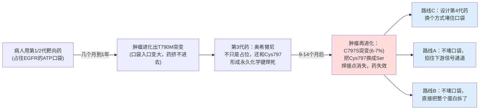
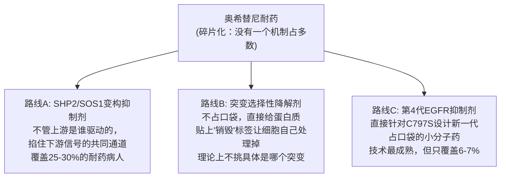
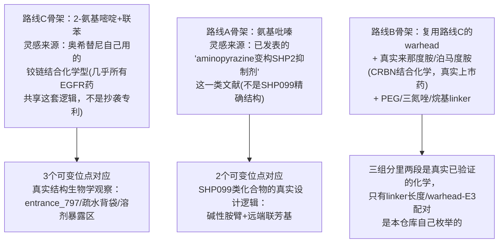
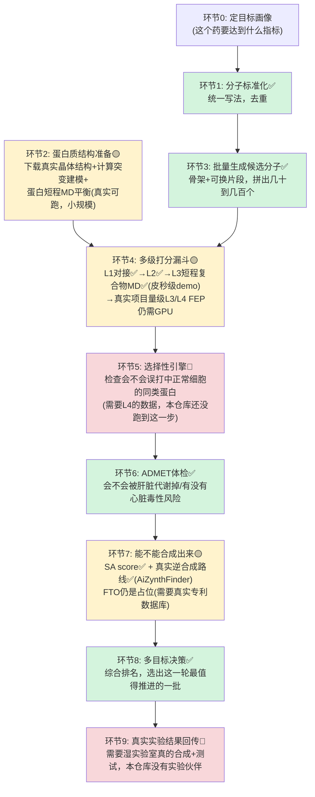
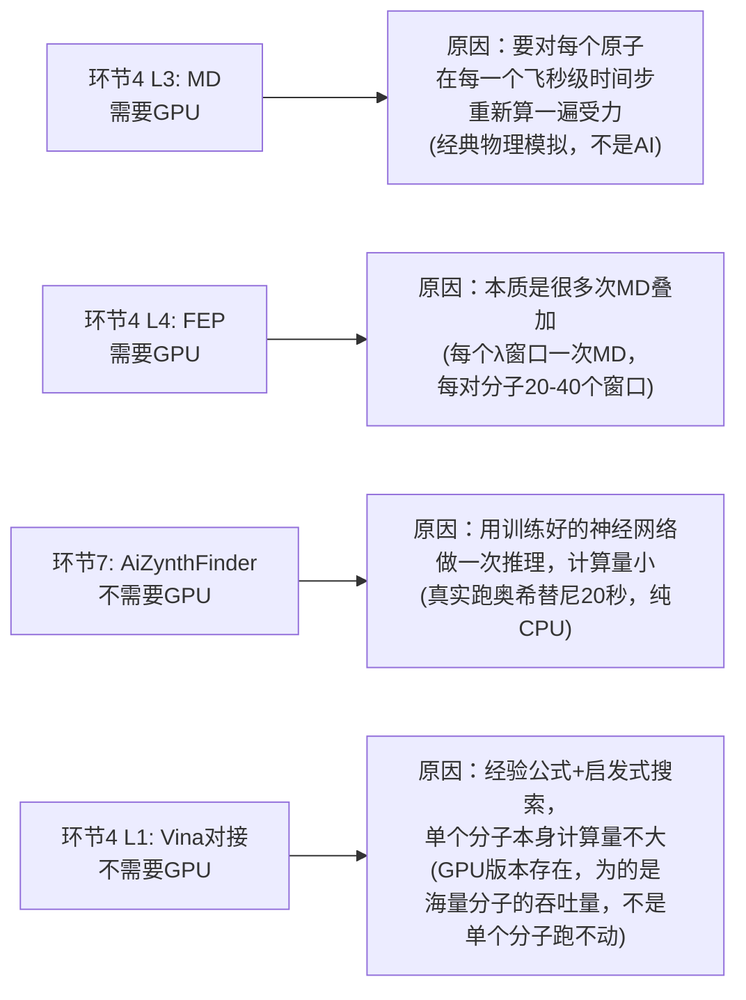
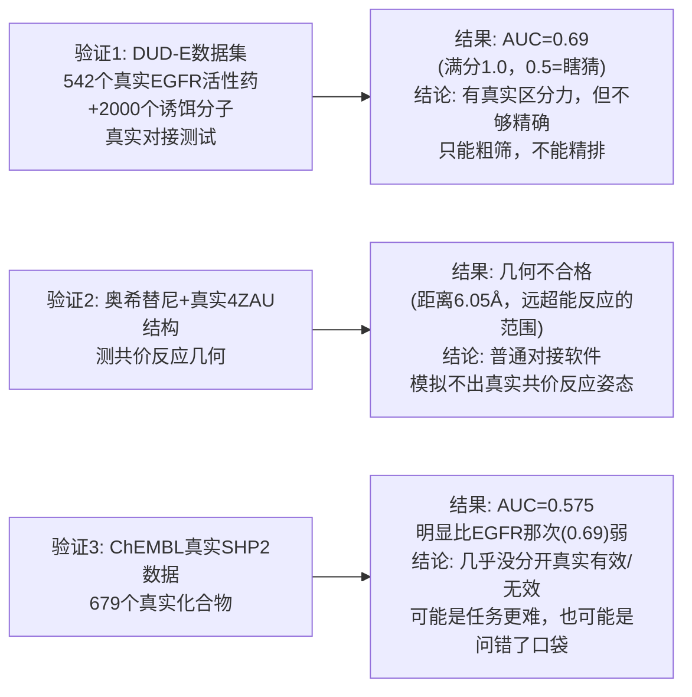
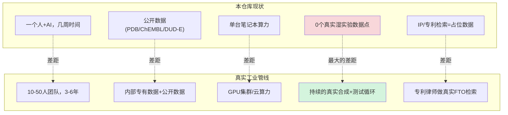
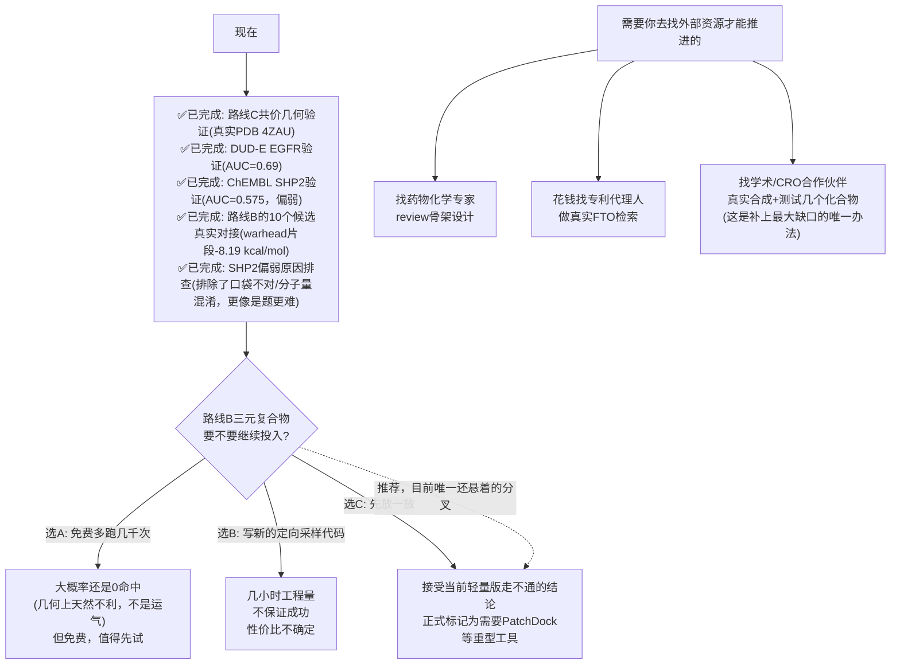
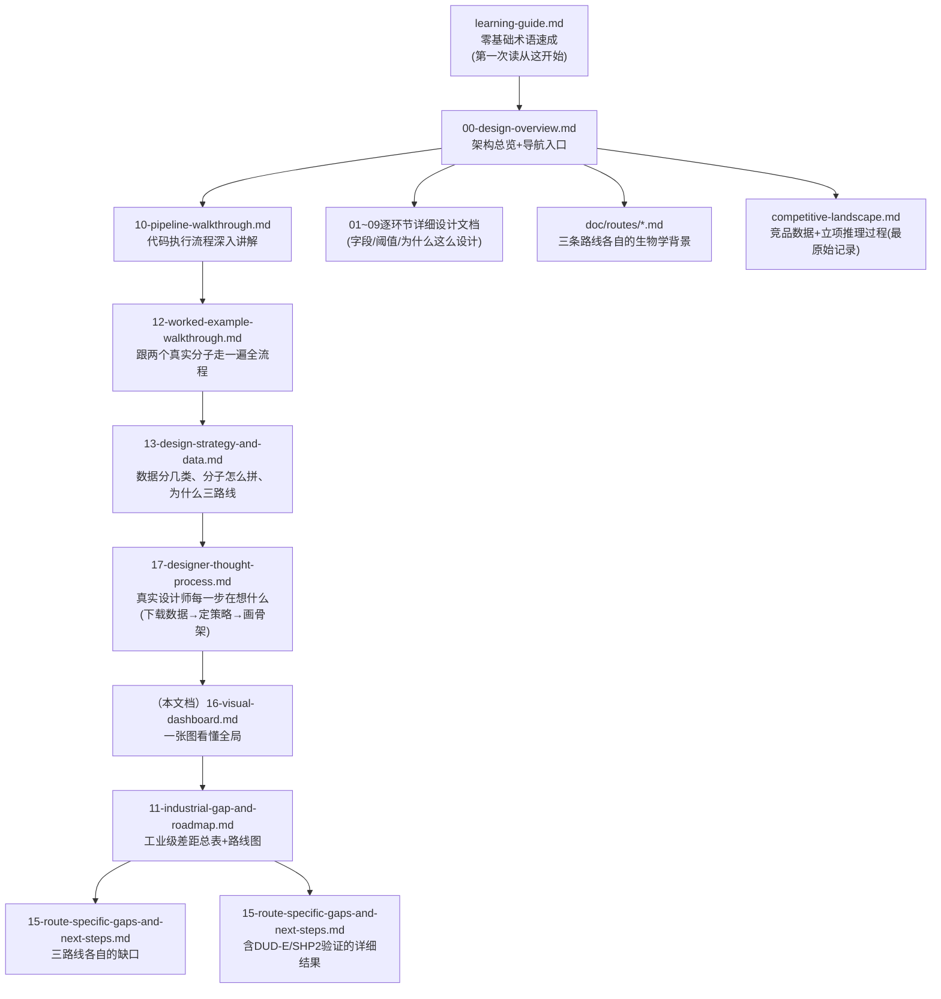

# 项目全景图：进度、差距、下一步(图文版，零生化背景可读)

这是整个仓库的"一张图看懂"版本——不需要先读完其他文档。每一节先放一张图，
图下面用大白话解释这张图在说什么，不假设你知道任何生物/化学术语。想深入
某一部分，图注会指到对应的详细文档。

全文数字口径：2026-10-06，直接查数据库/测试/文件得出，不是凭印象写的。

---

## 1. 我们在解决什么问题

**这张图说的是**：这是一场"军备竞赛"，不是一次性解决的问题。每一代药解决
上一代耐药机制的同时，都在给肿瘤细胞制造新的选择压力，逼出下一个耐药突变。
C797S(第3代药失效的原因)只是这场竞赛里的一个节点，而且查证后发现它只占
全部耐药病人的6-7%——另外约50%的病人甚至查不出明确的耐药原因，10-15%是
MET扩增，10-15%是HER2扩增。这个"碎片化"的格局，直接决定了下面第2节的
三路线战略。

## 2. 为什么同时做三条路线，不是只做一条

**这张图说的是**：碎片化的战场上，"收敛"(找一个能同时覆盖多种耐药机制的
共同节点)比"特异"(死磕某一个6-7%的小分片)更有胜算。三条路线不是三选一，
是分散在三种不同的生物学逻辑上——哪怕一条路线被竞争对手超越，另外两条
不受影响。三条路线**共用同一套计算代码**(`core/`)，区别只在于各自的配置
文件(靶点是谁、用什么骨架、口袋长什么样)。

## 3. 三条路线的骨架是怎么选出来的——不是凭空画的

**核心原则，三条路线完全一致——不是从零设计一个全新分子，是"借用已经被
验证过的化学逻辑，只在真正需要创新的地方自己设计"**：

- **路线C**：核心(2-氨基嘧啶铰链)直接借用奥希替尼自己在用的、几乎所有
  EGFR药共享的铰链结合化学型——这部分**不是创新点**，创新留给3个可变
  位点(对应真实结构生物学观察：哪里必须跟铰链形成氢键不能动、哪里决定
  突变体选择性、哪里纯粹用来调药代——详细的结构解读见
  [17-designer-thought-process.md](17-designer-thought-process.md))。
- **路线A**：核心(氨基吡嗪)的设计思路借用了**已发表的真实文献**("aminopyrazines
  as allosteric SHP2 inhibitors"这一类工作，详见[competitive-landscape.md](competitive-landscape.md))——
  **但明确不是对SHP099这个具体分子的精确复刻**，因为本仓库没有核实过
  SHP099的精确原子连接方式，为避免凭记忆编错结构，只借用"碱性胺+联芳基"
  这个总体设计思路，具体取代模式是重新设计的。
- **路线B**：三组分里warhead直接复用路线C已经设计好的化学(固定了两个
  R基团，把第三个位置改成linker出口)，E3配体是**真实上市药物**(来那度胺/
  泊马度胺，经RDKit核对过分子式和公开数据一致)，linker用的是PROTAC
  领域真实常见的几种类型(PEG/三氮唑/烷基链)——三组分里两段完全是真实
  已验证的化学，本仓库自己"设计"的只是把它们组合起来的方式。

**这是不是行业真实做法——是的，这是行业标准做法，不是本仓库自己发明的
捷径**：药物化学里这套思路有个专门的名字叫**骨架跳跃(scaffold hopping)**——
几乎没有团队会在完全不参考任何已知结构的情况下凭空设计一个全新核心，
因为那样风险极高(不知道这个核心能不能在物理上稳定结合、能不能合成出来)。
真实公司做的事和本仓库的逻辑完全一致：查文献/专利确认一个化学型的
"骨架"部分已经被验证过能在这类口袋里工作，自己的创新投入到外围取代基
(R基团)上去做真正的优化——区别只在于，真实公司有真正的药物化学家做
这个判断、有专利律师确认能不能用，本仓库这几个骨架是illustrative_only
(用来演示数据结构，不是真实候选起点)，判断过程是模仿真实思路，不是
真实专家做的决定。完整的思考过程(每一步具体在想什么)见
[17-designer-thought-process.md](17-designer-thought-process.md)。

## 4. 一个候选药物分子要经过哪些计算步骤

**这张图说的是**：从"定目标"到"选出候选批次"要走9个环节，颜色代表真实
程度——**绿色=真实能跑、有真实数据**，**黄色=部分真实(一部分能跑，一部分
受限于算力/工具还是占位)**，**红色=目前完全没跑到这一步**。这不是悲观的
自我批评，是诚实的进度刻度——本仓库从第一天起的原则就是"宁可标红，不
编造绿色"。

**环节3(批量生成候选分子)为什么必须紧跟着一整条打分漏斗，这里先说重点**：
骨架定好之后，每个可变位点挂不同的小片段，真实数字是路线C的3个位点
各挂6/6/9个候选片段，组合数6×6×9=**324**(数据库里路线C那324个候选的
真实来源)——这还只是"每个位置个位数选项"的小规模demo，真实工业库里
每个位置常有几百到几千种候选片段，组合数轻松冲到百万甚至更高(完整的
数学推导和更大规模的例子见[10-pipeline-walkthrough.md第8节](10-pipeline-walkthrough.md))。
**正因为一次"加个小基团"就能把候选数炸到这个量级，环节4才必须设计成
一个从便宜到贵的漏斗**——不可能对百万分子都跑几个GPU小时的精确计算，
只能先用毫秒级的粗筛淘汰绝大多数，让最后只有几十个幸存者配得上最贵的
精确方法。

## 5. 每个阶段：本项目用什么技术，工业界用什么，开源方案是什么

| 环节 | 本项目真实用的 | 工业界商业软件(真实存在的产品名) | 开源/免费替代 |
|---|---|---|---|
| 1 标准化 | RDKit | ChemAxon Standardizer, BIOVIA Pipeline Pilot | RDKit, OpenBabel |
| 2 结构准备 | RCSB下载 + PyRosetta(突变建模) + OpenMM/PDBFixer(MD平衡) | Schrödinger Prime(同源建模)+Desmond(MD)，MOE | PyRosetta, OpenMM, AlphaFold/ColabFold |
| 3 枚举 | RDKit分子拼接(molzip)，自己写的规则 | Schrödinger CombiGlide, ChemAxon Reactor；生成式AI(Chemistry42, Insilico Medicine) | RDKit；REINVENT等生成式开源模型 |
| 4 L1-L2对接 | AutoDock Vina + Meeko | Schrödinger Glide, OpenEye FRED/HYBRID, MOE Dock | AutoDock Vina/GPU, Gnina(带深度学习打分), rDock |
| 4 L3 MD/MM-GBSA | OpenMM + AmberTools(GAFF) | Schrödinger Desmond + Prime MM-GBSA | OpenMM, GROMACS, AMBER(学术免费) |
| 4 L4 FEP | 未装(`openfe`，本仓库没有GPU) | Schrödinger FEP+ | OpenFE, Yank |
| 4.3 共价对接 | 自写几何判据(Vina位姿+自写距离/角度提取) | Schrödinger CovDock | 没有成熟的直接开源替代，学术代码零散 |
| 5 选择性 | 自写热力学数学(纯Python) | 内置在FEP+等商业工具的多靶点分析模块里 | 同FEP开源栈，自己写后处理 |
| 6 ADMET | RDKit描述符 + 自写规则引擎 | Schrödinger QikProp, ADMET Predictor(Simulations Plus), BIOVIA | RDKit, DeepChem的开源ADMET模型 |
| 7 逆合成 | AiZynthFinder(真实神经网络+建块库) | Synthia(原Chematica)、Reaxys合成规划模块 | AiZynthFinder, ASKCOS(MIT开源) |
| 7 FTO | 未接入(需要真实专利数据库) | Reaxys/SciFinder + 专利律师 | Google Patents(能检索，不能做专业FTO分析) |
| 8 决策 | 自写Pareto前沿+几何平均(纯Python) | Schrödinger LiveDesign, Spotfire/内部BI工具 | 自己写，或用开源多目标优化库(pymoo) |
| 9 DMTA回传 | 自写SQL+Python分析 | Dotmatics, CDD Vault, Benchling | 自建数据库+Python |

**几个值得注意的模式**：
1. 几乎每一行"工业界商业软件"都对应着一家真实公司(Schrödinger/OpenEye/
   ChemAxon/Simulations Plus)——计算药物设计是一个真实存在、营收规模可观
   的软件行业，不是只有大药厂自己闷头写代码。
2. 本项目用的几乎全是**开源方案**，这是刻意的选择(成本为零，学习/验证
   足够)，不是"因为穷"——真实工业界也大量使用开源工具(OpenMM/RDKit/
   AutoDock在药企内部也很常见)，commercial软件的价值通常在"更好的图形
   界面/客服支持/和其他商业工具的集成/某些特定场景下更高的精度验证"，
   不是"开源工具做不到"。
3. **FEP+和CovDock这两行最能体现商业软件的真实壁垒**：开源FEP(OpenFE)
   功能上能做同样的事，但商业FEP+在易用性/验证过的力场参数/和其他
   Schrödinger产品线的集成上领先；共价对接目前确实没有成熟的开源平替，
   这也是为什么本仓库这次只能自己写几何判据去近似，不是真的共价对接。

## 6. 哪些阶段需要大量GPU计算，为什么——不是所有"模型"都需要GPU

**核心区分，容易被"这是不是AI模型"这个问题带偏**：GPU真正的瓶颈是
**"要重复做海量次数的简单数值计算"**这种计算模式，不是"用没用神经网络"。
MD/FEP是经典牛顿力学模拟，从头到尾没有任何神经网络，但需要GPU，因为
一次合格的模拟要在飞秒(10⁻¹⁵秒)尺度上走几百万到几十亿步，每一步都要对
系统里几千个原子两两算一遍相互作用力——这是极其重复、高度并行的浮点运算
(每个原子对的计算彼此独立)，正好是GPU(几千个简单计算核心同时跑)的强项，
比CPU(几十个复杂核心)快一到两个数量级。反过来，AiZynthFinder确实是真正
训练过的神经网络，但"用一个已经训练好的网络做一次推理判断"计算量很小，
CPU完全跑得动(本仓库真实验证过，20秒出结果)。

本仓库真实测过的量化证据：OpenMM在这台Mac的CPU上跑10ps蛋白MD用了86秒，
换算下来真实项目需要的20ns×3副本量级要数十小时到几天——这就是"MD/FEP
需要GPU"这句话背后的真实依据，不是泛泛而谈，而是实测吞吐量的外推。

## 7. 三条路线各自实际走到了哪一步(真实数据，查库得出)

| | 路线A(SHP2/SOS1) | 路线B(降解剂) | 路线C(四代TKI) |
|---|---|---|---|
| 环节1-3(生成候选分子) | ✅ 16个 | ✅ 10个 | ✅ 324个 |
| 环节2(蛋白质结构) | ✅ 2个真实结构(5EHR/6SCM) | ✅ 1个真实结构(4TZ4) | ✅ 2个(1个真实晶体+1个计算建模) |
| 环节4 L1(真实对接) | ✅ 16个，有真实分数 | ✅ 10个(warhead片段-8.19 kcal/mol；第一次整分子对接是方法学陷阱，已纠正，见第8节) | ✅ 24个，两个基因型交叉验证 |
| 环节4(方法本身验不验证过) | ✅ 做过(SHP2真实数据，AUC=0.575，比EGFR弱，见第8节) | 不适用(还没到这一步) | ✅ 做过一次(EGFR通用口袋，AUC=0.69) |
| 环节4(路线专属难点) | 不适用 | 🔴 三元复合物几何：真实试过，500次0命中(见下方说明) | ✅ 共价几何判据：真实测过一次(用奥希替尼+真实结构) |
| 环节8(决策批次) | ✅ 跑过 | ❌ **没跑过**(核心输入数据缺失) | ✅ 跑过 |
| 环节4 L3-L4(MD/FEP) | ❌ 需要GPU，没跑 | ❌ 需要GPU，没跑 | ❌ 需要GPU，没跑 |
| 环节9(真实实验反馈) | ❌ | ❌ | ❌ |

**路线B客观上最落后，不是态度问题**：三元复合物问题是指——降解剂需要让
"目标蛋白+降解剂+另一个蛋白(E3连接酶)"三者同时摆出合适的姿势才能起效，
这次真实用计算工具试了500次随机摆放，一次都没摆出合适姿势(最接近的一次
也差了一倍多的距离)。这是一个真实存在的技术难题，不是算错了，下面第10节
会讲清楚接下来怎么选。

## 8. 刚做完的几个真实验证，到底测出了什么

**这三个验证在做同一件事——拿已经知道真实答案的数据，倒过来检验"我们的
计算方法到底靠不靠谱"**，这比继续往系统里加新功能更重要。好比先用已经
知道对错的练习题检验一下解题方法本身对不对，再去做没有答案的新题。

- **验证1的结论**：对接方法不是瞎猜，但精度有限——这验证了本仓库从头到尾
  坚持的一条规则："这类快速对接只能用来排除明显不行的候选，不能拿来在
  剩下的候选里排名次"。
- **验证2的结论**：这次用真实已知"确实会起反应"的奥希替尼去测，结果显示
  普通对接软件给出的姿态和真实反应所需的姿态差得很远——证明了"要做共价
  反应预测，普通对接工具不够，需要专门的共价对接软件"这条早就知道的限制，
  现在有了具体数字支撑。
- **验证3的结论(比预期弱，诚实记录)**：679个真实ChEMBL SHP2化合物(400个
  真实有效+279个真实测过但无效的)跑完，AUC只有0.575，真实有效和真实
  无效的化合物平均打分几乎一样(-8.42 vs -8.41 kcal/mol)——这次对接**没能
  有效区分**。两个可能原因：①这里的"无效"分子是同一优化系列里的真实
  类似物，比DUD-E的人工诱饵更难区分；②更可能是"问错了口袋"——ChEMBL的
  SHP2数据可能混了两种不同结合机制的抑制剂，用的受体只代表其中一种口袋。
  详见[15](15-route-specific-gaps-and-next-steps.md)。

## 9. 和"真正的工业级药物研发"差多少

**最关键的一句话**：工业界真正的护城河不是"算得准"，是**"算→真的合成
出来→真的测试→拿真实结果回头校准算法→再算"**这个循环能不能转起来，
而且每转一圈模型都在用真实数据变得更准。本仓库现在转的是"算→算→算"，
从没有真实实验数据输入过，所有判断的正确性都只停留在"逻辑有没有写对"，
没有一次停留在"预测准不准"——上面第8节的三个retrospective验证，就是在
用公开的"已知答案"数据，尽量弥补"没有真实实验反馈"这个最大缺口，但这
终究是替代品，不是真实的实验闭环。

完整的分维度差距表(团队/合规/IP/算力/模型验证严谨度等12个维度逐项对比)
见[11-industrial-gap-and-roadmap.md](11-industrial-gap-and-roadmap.md)；
三条路线各自单独的缺口见[15-route-specific-gaps-and-next-steps.md](15-route-specific-gaps-and-next-steps.md)。

## 10. 接下来怎么走：一张决策图

**现在就能做、不用等你拍板的**：路线B的10个候选分子对接(代码现成，随时
能跑)。**需要你做选择的**：路线B三元复合物要不要继续投入(推荐选C，先放
一放，原因见上图)。**需要你去外部找资源才能推进的**：专家review、真实
FTO、真实实验合作——这些不是在这个环境里靠继续计算能解决的。

## 11. 全部文档地图(都在讲什么)

**简化版阅读顺序**：零基础 → `learning-guide.md` → 本文档(`16`) → 想深入
哪条路线就去读`doc/routes/`下对应那篇 → 想知道某个环节具体怎么算就去读
`01`-`09`对应那篇。不需要按数字顺序把全部文档读一遍。

---

看完这张全景图，你应该已经知道："现在做到哪了、和真实工业界差多少、
接下来谁该做什么决定"这三个问题的答案。细节不记得没关系，随时可以回来
翻这篇，每张图下面都有指向详细文档的链接。
