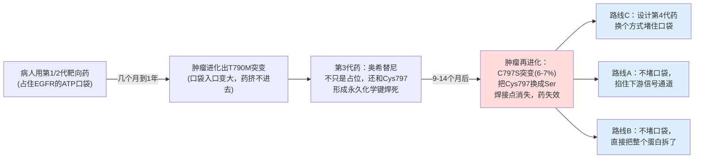
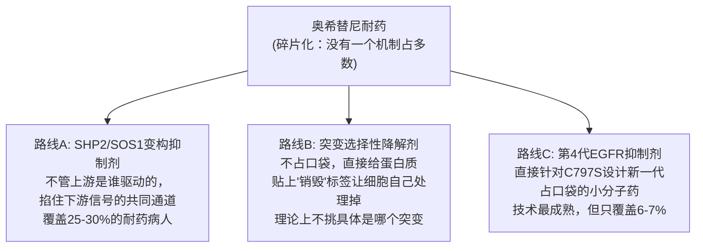
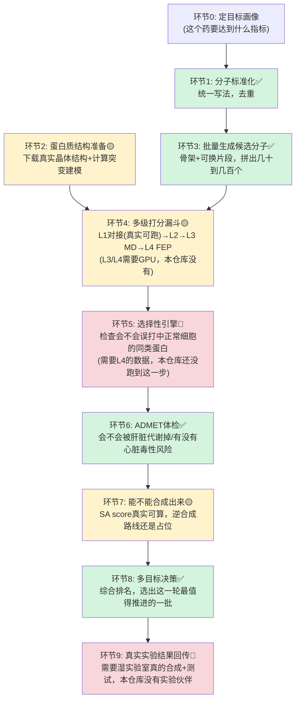
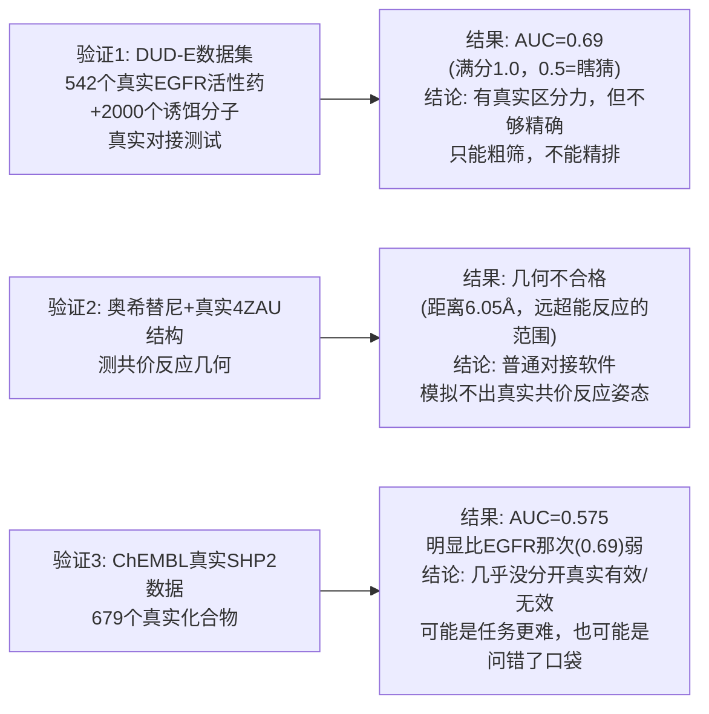
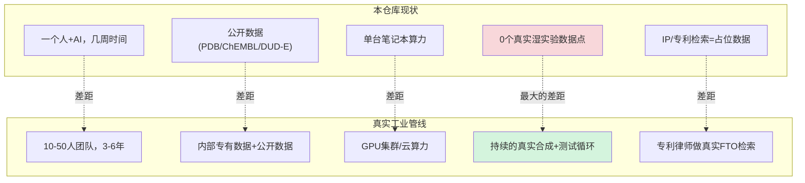
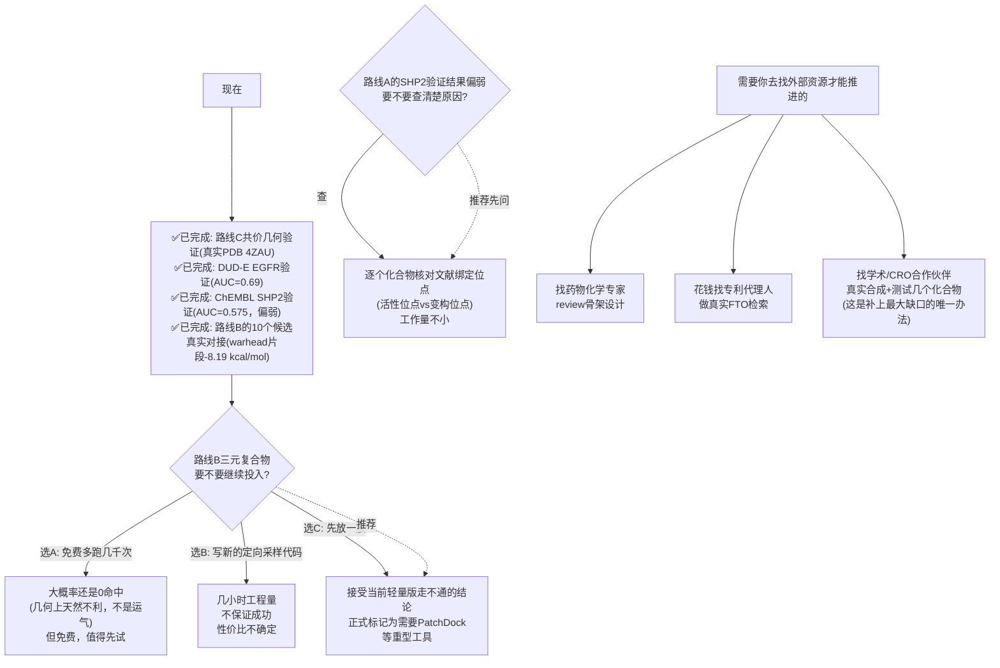
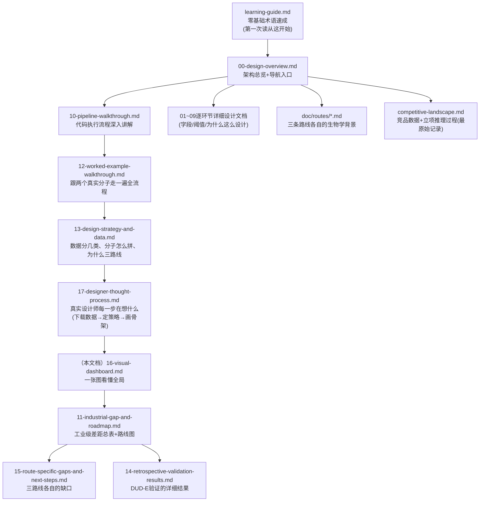

# 项目全景图：进度、差距、下一步(图文版，零生化背景可读)

这是整个仓库的"一张图看懂"版本——不需要先读完其他17份文档。每一节先放一张图，
图下面用大白话解释这张图在说什么，不假设你知道任何生物/化学术语。想深入
某一部分，图注会指到对应的详细文档。

全文数字口径：2026-10-06，直接查数据库/测试/文件得出，不是凭印象写的。

---

## 1. 我们在解决什么问题

**这张图说的是**：这是一场"军备竞赛"，不是一次性解决的问题。每一代药解决
上一代耐药机制的同时，都在给肿瘤细胞制造新的选择压力，逼出下一个耐药突变。
C797S(第3代药失效的原因)只是这场竞赛里的一个节点，而且查证后发现它只占
全部耐药病人的6-7%——另外约50%的病人甚至查不出明确的耐药原因，10-15%是
MET扩增，10-15%是HER2扩增。这个"碎片化"的格局，直接决定了下面第2节的
三路线战略。

## 2. 为什么同时做三条路线，不是只做一条

**这张图说的是**：碎片化的战场上，"收敛"(找一个能同时覆盖多种耐药机制的
共同节点)比"特异"(死磕某一个6-7%的小分片)更有胜算。三条路线不是三选一，
是分散在三种不同的生物学逻辑上——哪怕一条路线被竞争对手超越，另外两条
不受影响。三条路线**共用同一套计算代码**(`core/`)，区别只在于各自的配置
文件(靶点是谁、用什么骨架、口袋长什么样)。

## 3. 一个候选药物分子要经过哪些计算步骤

**这张图说的是**：从"定目标"到"选出候选批次"要走9个环节，颜色代表真实
程度——**绿色=真实能跑、有真实数据**，**黄色=部分真实(一部分能跑，一部分
受限于算力/工具还是占位)**，**红色=目前完全没跑到这一步**。这不是悲观的
自我批评，是诚实的进度刻度——本仓库从第一天起的原则就是"宁可标红，不
编造绿色"。

## 4. 三条路线各自实际走到了哪一步(真实数据，查库得出)

| | 路线A(SHP2/SOS1) | 路线B(降解剂) | 路线C(四代TKI) |
|---|---|---|---|
| 环节1-3(生成候选分子) | ✅ 16个 | ✅ 10个 | ✅ 324个 |
| 环节2(蛋白质结构) | ✅ 2个真实结构(5EHR/6SCM) | ✅ 1个真实结构(4TZ4) | ✅ 2个(1个真实晶体+1个计算建模) |
| 环节4 L1(真实对接) | ✅ 16个，有真实分数 | ✅ 10个(warhead片段-8.19 kcal/mol；第一次整分子对接是方法学陷阱，已纠正，见第5节) | ✅ 24个，两个基因型交叉验证 |
| 环节4(方法本身验不验证过) | ✅ 做过(SHP2真实数据，AUC=0.575，比EGFR弱，见第5节) | 不适用(还没到这一步) | ✅ 做过一次(EGFR通用口袋，AUC=0.69) |
| 环节4(路线专属难点) | 不适用 | 🔴 三元复合物几何：真实试过，500次0命中(见下方说明) | ✅ 共价几何判据：真实测过一次(用奥希替尼+真实结构) |
| 环节8(决策批次) | ✅ 跑过 | ❌ **没跑过**(核心输入数据缺失) | ✅ 跑过 |
| 环节4 L3-L4(MD/FEP) | ❌ 需要GPU，没跑 | ❌ 需要GPU，没跑 | ❌ 需要GPU，没跑 |
| 环节9(真实实验反馈) | ❌ | ❌ | ❌ |

**路线B客观上最落后，不是态度问题**：三元复合物问题是指——降解剂需要让
"目标蛋白+降解剂+另一个蛋白(E3连接酶)"三者同时摆出合适的姿势才能起效，
这次真实用计算工具试了500次随机摆放，一次都没摆出合适姿势(最接近的一次
也差了一倍多的距离)。这是一个真实存在的技术难题，不是算错了，下面第7节
会讲清楚接下来怎么选。

## 5. 刚做完的几个真实验证，到底测出了什么

**这三个验证在做同一件事——拿已经知道真实答案的数据，倒过来检验"我们的
计算方法到底靠不靠谱"**，这比继续往系统里加新功能更重要。好比先用已经
知道对错的练习题检验一下解题方法本身对不对，再去做没有答案的新题。

- **验证1的结论**：对接方法不是瞎猜，但精度有限——这验证了本仓库从头到尾
  坚持的一条规则："这类快速对接只能用来排除明显不行的候选，不能拿来在
  剩下的候选里排名次"。
- **验证2的结论**：这次用真实已知"确实会起反应"的奥希替尼去测，结果显示
  普通对接软件给出的姿态和真实反应所需的姿态差得很远——证明了"要做共价
  反应预测，普通对接工具不够，需要专门的共价对接软件"这条早就知道的限制，
  现在有了具体数字支撑。
- **验证3的结论(比预期弱，诚实记录)**：679个真实ChEMBL SHP2化合物(400个
  真实有效+279个真实测过但无效的)跑完，AUC只有0.575，真实有效和真实
  无效的化合物平均打分几乎一样(-8.42 vs -8.41 kcal/mol)——这次对接**没能
  有效区分**。两个可能原因：①这里的"无效"分子是同一优化系列里的真实
  类似物，比DUD-E的人工诱饵更难区分；②更可能是"问错了口袋"——ChEMBL的
  SHP2数据可能混了两种不同结合机制的抑制剂，用的受体只代表其中一种口袋。
  详见[15](15-route-specific-gaps-and-next-steps.md)。

## 6. 和"真正的工业级药物研发"差多少

**最关键的一句话**：工业界真正的护城河不是"算得准"，是**"算→真的合成
出来→真的测试→拿真实结果回头校准算法→再算"**这个循环能不能转起来，
而且每转一圈模型都在用真实数据变得更准。本仓库现在转的是"算→算→算"，
从没有真实实验数据输入过，所有判断的正确性都只停留在"逻辑有没有写对"，
没有一次停留在"预测准不准"——上面第5节的三个retrospective验证，就是在
用公开的"已知答案"数据，尽量弥补"没有真实实验反馈"这个最大缺口，但这
终究是替代品，不是真实的实验闭环。

完整的分维度差距表(团队/合规/IP/算力/模型验证严谨度等12个维度逐项对比)
见[11-industrial-gap-and-roadmap.md](11-industrial-gap-and-roadmap.md)；
三条路线各自单独的缺口见[15-route-specific-gaps-and-next-steps.md](15-route-specific-gaps-and-next-steps.md)。

## 7. 接下来怎么走：一张决策图

**现在就能做、不用等你拍板的**：路线B的10个候选分子对接(代码现成，随时
能跑)。**需要你做选择的**：路线B三元复合物要不要继续投入(推荐选C，先放
一放，原因见上图)。**需要你去外部找资源才能推进的**：专家review、真实
FTO、真实实验合作——这些不是在这个环境里靠继续计算能解决的。

## 8. 全部文档地图(18份文档都在讲什么)

**简化版阅读顺序**：零基础 → `learning-guide.md` → 本文档(`16`) → 想深入
哪条路线就去读`doc/routes/`下对应那篇 → 想知道某个环节具体怎么算就去读
`01`-`09`对应那篇。不需要按数字顺序把18篇全读一遍。

---

看完这张全景图，你应该已经知道："现在做到哪了、和真实工业界差多少、
接下来谁该做什么决定"这三个问题的答案。细节不记得没关系，随时可以回来
翻这篇，每张图下面都有指向详细文档的链接。
