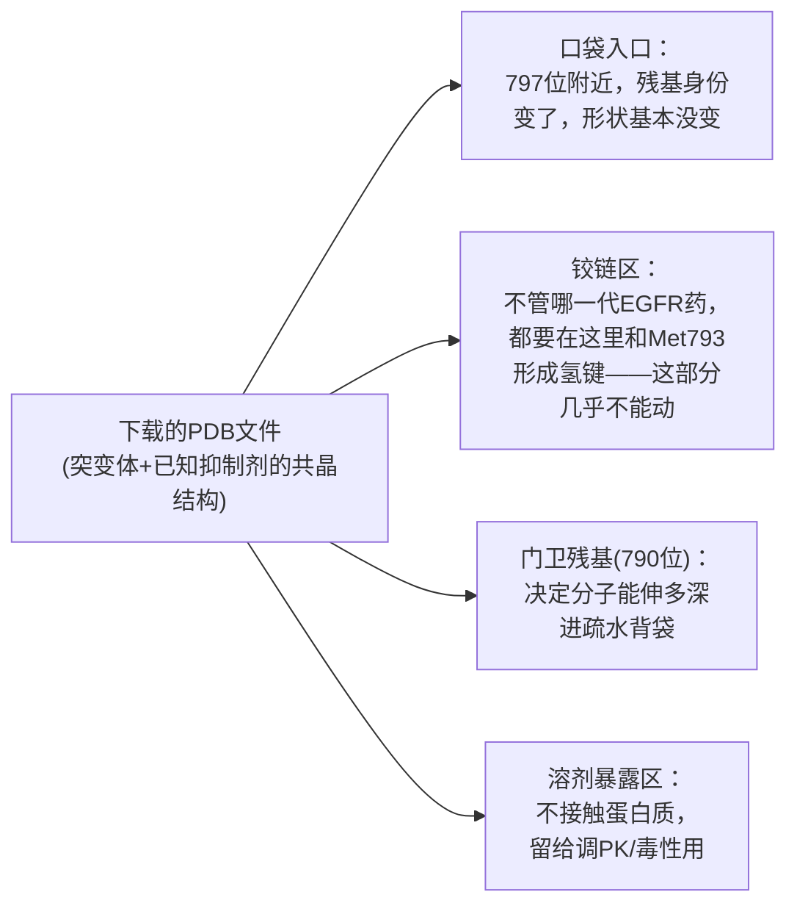
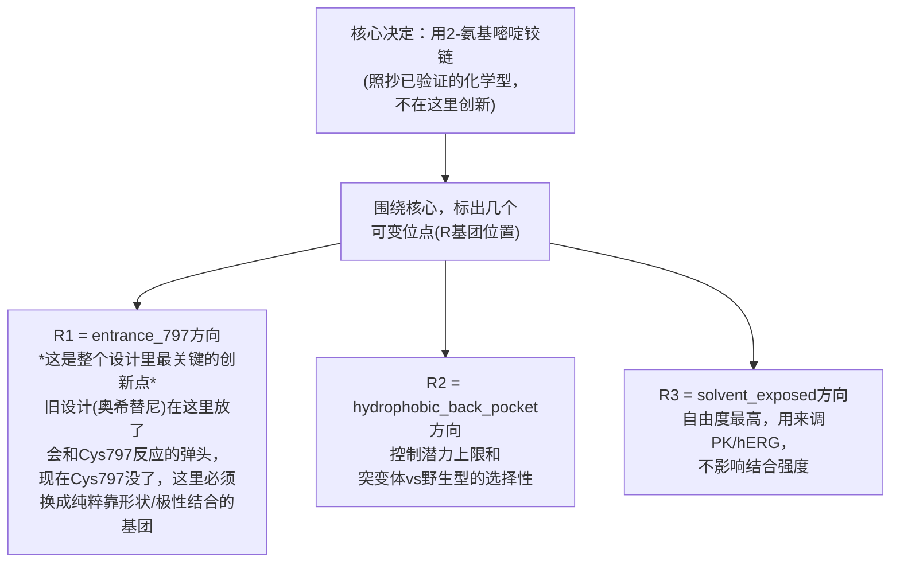
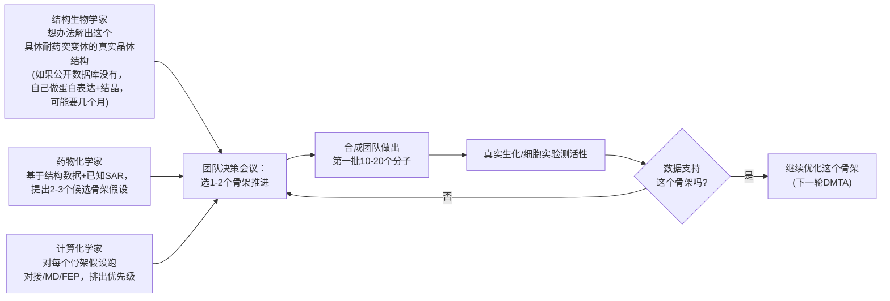

# 从下载数据到设计骨架：一个真实药物设计师的完整思考过程

前面几篇文档讲的是"代码怎么跑"。这篇讲"**人**怎么想"——如果你是一个真实
制药公司里的药物化学家/计算化学家，拿到"奥希替尼耐药，去想办法"这个任务，
从第一天开始，脑子里实际在想什么、每一步为什么这么做、下载的每一份数据
具体回答了什么问题。全程用本仓库里真实验证过的数据和这次会话里真实做过
的计算做例子，不是抽象讲道理。

---

## 第一天：这甚至不是一个"设计分子"的问题，是一个"选策略"的问题

拿到"奥希替尼耐药"这个任务，**第一件事不是打开电脑画分子**，是回答一个
更根本的问题：**耐药之后，这个靶点还能不能用小分子打？用什么机制打？**

这一步纯粹是读文献+看数据，不涉及任何化学结构：

1. **搞清楚耐药机制的分子细节**：C797S做了什么？真实答案——EGFR第797位
   的半胱氨酸(Cys)变成了丝氨酸(Ser)。半胱氨酸侧链有个硫原子(-SH)，这正是
   奥希替尼"焊接"用的化学把手；丝氨酸没有这个硫，焊不上了。**这个事实
   直接决定了接下来能走哪几条路**：
   - 硫没了，不代表口袋整个坏了——口袋的整体几何形状基本没变(只是一个
     残基的侧链变了)，理论上一个**不需要焊接、靠非共价相互作用也能结合
     得够牢**的分子应该还能用。
   - 或者，找口袋里**另一个**还存在的、可以焊接的半胱氨酸(新位点共价)。
   - 或者，干脆做一个对好几种耐药突变体都广谱有效的覆盖型共价分子。
   这三条路，在本仓库`target_profile.yaml`里对应`chemistry_route`的三个
   选项：`reversible_orthosteric`/`covalent_new_site`/
   `covalent_pan_mutant_broad`，**在看到任何具体分子结构之前，这个选择
   已经要做了**。

2. **查"别人已经怎么做了"——这是真实行业里最重要的一步，比自己从头想
   更快更可靠**。药物设计几乎从不从一张白纸开始，第一件事永远是查清楚
   "这个问题，业界已经公开验证到什么程度了"：
   - **tigozertinib(BLU-945)，Blueprint Medicines**：真实公开数据显示它是
     **reversible/non-covalent**，对T790M/C797S双突变和三突变都有活性。
     **这一条信息本身就是决定性的**——它直接证明了"不焊接，靠非共价也能
     打中C797S"这条路线在生物学上是走得通的，不是理论猜测，是真实有人
     做出来了。
   - **silevertinib(BDTX-1535)，Black Diamond**：真实公开数据显示它是
     **共价**，但换了个不依赖Cys797的新位点。这证明了第二条路(新位点共价)
     也走得通。
   - 两条路都有人验证过能走通，意味着"选哪条"更多是基于你自己的化学
     积累/专利空间/风险偏好，不是基于"哪条路理论上可行"——这也是为什么
     本仓库最终把`reversible_orthosteric`设成主攻、`covalent_new_site`
     设成backup：参考的正是tigozertinib这个真实precedent。

**这一步的产出不是一个分子，是一个"打法"的决定。** 本仓库`target_profile.yaml`
里那几行`chemistry_route`配置，背后是这整段真实的竞品分析，不是随手写的。

## 第二步：下载的第一份数据——蛋白质三维结构，到底在看什么

决定了"打法"之后，才轮到"这个分子要长成什么样"。但在画任何结构之前，
必须先有**真实的、三维的靶点结构**——这是从RCSB PDB下载`.pdb`文件这件事
的意义。一个真实的设计师拿到这个文件，眼睛在看什么：

本仓库真实下载的6LUD(L858R/T790M/C797S三突变体+奥希替尼真实共晶结构)，
一个设计师拿到它要确认的事：

- **口袋整体还能不能装下一个和奥希替尼大小相近的分子**——通过真实检查
  797位残基周围的空间(丝氨酸比半胱氨酸还小一点，理论上空间更宽松不是
  更紧)，答案是能。这一步决定了"重新设计"是不是一个合理的目标，而不是
  必须推倒重来。
- **铰链区的氢键受体/供体模式**——几乎所有EGFR TKI(第1/2/3/4代，不管
  哪条化学路线)都要在这个区域和Met793形成保守的氢键，这是**不能随便
  改的部分**，这也是为什么本仓库demo骨架的核心(2-氨基嘧啶铰链)是直接
  照抄这个几乎所有EGFR药都在用的、已经被反复验证过的化学逻辑——**这不是
  偷懒，是正确的做法：铰链区不是用来创新的地方，创新要留给能真正体现
  差异化的区域**。
- **门卫残基(790位)的大小**——第1/2代药失效正是因为T790M让这个位置变大、
  挤占了原本的空间；这次我们关心的三突变体790位已经通过T790M固定成了
  "大"的状态，意味着新分子要么接受这个空间限制，要么像奥希替尼一样设计
  得能适应变大的门卫。
- **溶剂暴露区在哪**——这部分不接触蛋白质，是整个分子里"自由度最高、
  风险最低"的改造区域，适合用来调溶解度/hERG风险/代谢稳定性，不影响
  结合强度。

**这就是为什么本仓库的`pocket_regions.yaml`把口袋切成entrance_797/
hydrophobic_back_pocket/solvent_exposed三个区域——这三个区域不是随便
分的，是直接对应上面这几个真实的结构生物学观察。**

## 第三步：下载的第二份数据——化合物活性数据，到底回答什么问题

光有蛋白质结构还不够，还需要知道"**什么样的化学结构，历史上已经证明能
在这个蛋白质家族的口袋里结合**"。这就是查ChEMBL/文献里已知活性化合物的
意义——**不是为了抄结构**(抄袭已知专利分子直接撞上FTO问题)，是为了回答
三个问题：

1. **这一类口袋，什么"骨架化学"是被反复验证过能用的？** 答案(真实、
   可查证的事实)：几乎所有EGFR TKI，不管哪一代，核心都是能在铰链区形成
   氢键的含氮芳香环系统——奥希替尼本身是2-氨基嘧啶核心，吉非替尼/厄洛
   替尼是喹唑啉核心，逻辑相通。这告诉设计师："铰链结合化学"这个子问题
   业界已经解决很多次了，不需要重新发明，直接采用已经被验证过的化学型
   (这在药物化学里有个专门的名字，叫**骨架跳跃/scaffold hopping**——
   借用已验证的核心，只在外围做真正的创新)。
2. **哪些取代基模式已经被证明是"安全"或"危险"的？** 比如本仓库真实查过
   的发现：tigozertinib的哌啶氮直接连在嘧啶环上(芳香胺，碱性被削弱)，
   这个设计选择让它成为三个真实对照药里唯一hERG代理风险显示"low"的——
   这是一个可以直接学习、复用的真实设计经验，不是理论推测。
3. **竞品已经占用了哪些化学空间？**(这一步真实情况下需要专利律师介入，
   本仓库没有真实做，用`placeholder_not_real`诚实标注——但在真实公司里，
   这一步和前两步同时发生，不是分子设计完了才查)。

## 第四步：真正开始"设计骨架"——这一步具体在想什么

到这一步，才真正开始动笔画分子。但即便是这一步，**"设计骨架"的真实含义
不是凭空创造一个新结构，是把上面几步学到的所有信息，翻译成一张"哪个
位置该固定、哪个位置该留出可变空间"的地图**：

**这就是本仓库`scaffolds.yaml`里`core_smiles`+`attachment_points`这个
数据结构的真实含义**——不是一个随意的工程选择，是把"铰链区不能动、
entrance_797是创新重点、hydrophobic_back_pocket管选择性、solvent_exposed
管PK"这四条真实的结构生物学判断，固化成了配置文件里的字段。`core/enumerate.py`
后面做的批量组合，只是在这张"地图"画好之后，机械地填格子——**真正的脑力
劳动发生在画这张地图的阶段，不是填格子的阶段**。

这也回答了你说的"骨架会参考之前市面上已有的"：**参考不是照抄整个分子，
是参考"哪一部分该固定抄哪一代验证过的化学、哪一部分该留白去创新"这个
判断本身**。本仓库的demo骨架诚实标注了`illustrative_only`，正是因为这里
"固定铰链"这个判断是真实、有依据的，但具体选哪个R基团库、R基团该是什么
结构，没有经过真实药物化学家确认，只是用来演示这套数据结构怎么运作。

## 第五步：画完骨架草图，怎么验证这个判断没有错

真实设计师不会画完骨架就直接去合成，会先用计算的方式快速验证几个假设：

1. **把一个代表性分子(或者直接用奥希替尼本身)对接进这个突变体结构**，
   看铰链结合假设是否在3D上真的成立——本仓库真实做过(奥希替尼重新对接
   回6LUD，-7.758 kcal/mol，结合模式基本保留，印证了"口袋整体没坏"
   这条判断)。
2. **跑结构警示规则**，排除明显有毒性风险的基团组合。
3. **和已知竞品数据做个粗略的量级对比**(这正是这次会话做的retrospective
   验证在更大规模上做的事)。

确认这几步都没有明显问题，才会进入"批量生成候选+打分漏斗"这个本仓库
代码真正开始大规模运作的阶段——也就是`doc/10`/`doc/12`已经详细讲过的
部分。

## 如果这是真实工业界的项目，完整流程是什么样

上面全部内容，在真实制药公司里，**不是一个人靠查文献+计算就能走完的**，
是好几个专业角色并行工作：

**和本仓库最大的区别**：真实流程里第一步(结构生物学家解出真实晶体结构)
往往是最花时间的一步——本仓库这次会话真实查证过，del19/C797S和
L858R/C797S这两个本仓库最关心的基因型，**文献里明确提到"蛋白都没能
纯化到结晶级别"**，意味着真实团队在这一步可能要先攻克"怎么把这个蛋白
稳定下来结晶"这个技术问题，这本身可能是几个月到一年的工作，本仓库用
PyRosetta计算突变建模绕过了这一步，是一个**近似替代**，不是等价替代——
计算模型不能代替真实解出来的晶体结构，只是在没有晶体结构时的最佳可行
方案。另一个大区别是最后的Assay(真实实验)环节——本仓库完全没有，这也是
[doc/11](11-industrial-gap-and-roadmap.md)反复强调的最大缺口。

## 一句话总结这整个思考过程

**先想清楚打法(查竞品验证过什么)，再理解靶点的真实三维形状(哪里能动
哪里不能动)，再查清楚这类口袋已知的化学逻辑(哪部分该抄哪部分该创新)，
最后才把这些判断翻译成"骨架+可变位点"这张地图**——批量生成候选分子只是
最后机械执行这张地图的阶段，不是设计本身。本仓库的代码(`core/enumerate.py`
等)自动化的是地图画完之后的机械部分；地图怎么画，始终需要前面几步的
真实判断，这正是[doc/11](11-industrial-gap-and-roadmap.md)说"需要找
真正的药物化学家review"的那个环节——目前本仓库这张地图是**模仿**真实
判断的逻辑画出来的示例，不是一次真实的专家判断过程。
